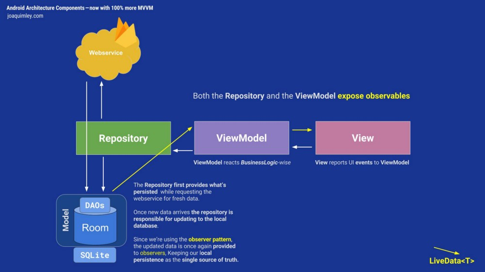

# TDD

https://www.raywenderlich.com/7109-test-driven-development-tutorial-for-android-getting-started

# android-MVVM
This is an example to demonstrate MVVM with repository

https://proandroiddev.com/mvvm-with-kotlin-android-architecture-components-dagger-2-retrofit-and-rxandroid-1a4ebb38c699

MVVM has mainly the following layers:

## Repository
The repository serves as the communication bridge between the data and the rest of the app.

## ViewModel
ViewModel should bridge the Repository and the View, this is also where your Business Logic lives.

## View
Finally, the view role in this pattern is to observe (or subscribe to) a ViewModel observable to get data in order to update UI elements accordingly.

https://medium.com/androiddevelopers/viewmodels-and-livedata-patterns-antipatterns-21efaef74a54

https://devanshramen.com/2017/12/17/mvvm-androids-architecture-components-part-2-repository-pattern/

# Android Helpful Links

https://blog.aritraroy.in/20-awesome-open-source-android-apps-to-boost-your-development-skills-b62832cf0fa4

https://blog.aritraroy.in/30-kickass-tools-to-develop-android-apps-like-a-pro-191e52b9419b

https://blog.aritraroy.in/15-tools-for-bulletproof-android-app-security-516bb8b1a8d5

https://blog.aritraroy.in/30-bite-sized-pro-tips-to-become-a-better-android-developer-b311fd641089

https://android.jlelse.eu/android-architecture-communication-between-viewmodel-and-view-ce14805d72bf

https://android-arsenal.com/

# RxJava/RxAndroid Helpful Links

https://blog.danlew.net/2014/09/15/grokking-rxjava-part-1/

https://blog.aritraroy.in/the-missing-rxjava-2-guide-to-supercharge-your-android-development-part-1-624ef326bff4

https://www.androidhive.info/RxJava/rxjava-operators-introduction/

https://github.com/amitshekhariitbhu/RxJava2-Android-Samples/tree/master/app/src/main/java/com/rxjava2/android/samples

https://blog.gojekengineering.com/multi-threading-like-a-boss-in-android-with-rxjava-2-b8b7cf6eb5e2

http://upday.github.io/blog/mvvm_rx_common_mistakes/

# Git branching

https://nvie.com/posts/a-successful-git-branching-model/

## used libraries

android architecture components

Dagger2

RxJava, RxAndroid

Retrofit

Glide
